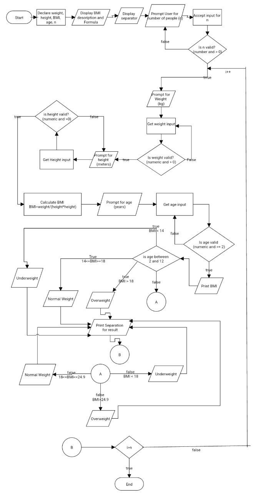

### Input
- weight (float): The person's weight in kilograms.
- height (float): The person's height in meters.
- age (float): The person's age in years.
- n (int): The number of people for whom the BMI is to be calculated.

### Output
- A message displaying each person's BMI and weight category (underweight, normal weight, overweight).

### Operation
1. **Declare Variables:**
   - Declare weight, height, BMI, age as float variables.
   - Declare n as an int variable.

2. **Display Description:**
   - Print a message that describes the purpose of the program and how BMI is calculated.

3. **Print Separator:**
   - Print a separator line for better readability.

4. **Prompt for Number of People:**
   - **Number Entry Loop:**
     - Print a prompt asking the user to enter the number of people for whom the BMI is to be calculated.
     - Read and store the user's input in the variable n.
     - If the input is invalid (not a number or less than or equal to 0):
       - Print "Wrong input. Please enter a valid number".
       - Go back to number entry loop.

5. **Iterate for Each Person:**
   - For each person from 1 to n:
     - **Prompt for Weight:**
       - **Weight Entry Loop:**
         - Print a prompt asking the user to enter the person's weight in kilograms.
         - Read and store the user's input in the variable weight.
         - If the input is invalid (not a number or less than or equal to 0):
           - Print "Wrong input. Please enter a valid weight".
           - Go back to weight entry loop.

     - **Prompt for Height:**
       - **Height Entry Loop:**
         - Print a prompt asking the user to enter the person's height in meters.
         - Read and store the user's input in the variable height.
         - If the input is invalid (not a number or less than or equal to 0):
           - Print "Wrong input. Please enter a valid height".
           - Go back to height entry loop.

     - **Compute BMI:**
       - Calculate the BMI using the formula weight / (height * height).

     - **Prompt for Age:**
       - **Age Entry Loop:**
         - Print a prompt asking the user to enter the person's age in years.
         - Read and store the user's input in the variable age.
         - If the input is invalid (not a number or less than 2):
           - Print "Wrong input. Please enter a valid age".
           - Go back to age entry loop.

     - **Display Result:**
       - Print the calculated BMI for the person.
       - Determine and print the person's weight category based on the BMI and age:
         - For ages 2 to 12:
           - If BMI < 14: Print "He/She is underweight".
           - If 14 <= BMI < 18: Print "He/She has normal weight".
           - Else: Print "He/She is overweight".
         - For ages above 12:
           - If BMI < 18.5: Print "He/She is underweight".
           - If 18.5 <= BMI < 24.9: Print "He/She has normal weight".
           - Else: Print "He/She is overweight".

6. **Print Separator:**
   - Print a separator line for better readability.

### Flowchart

