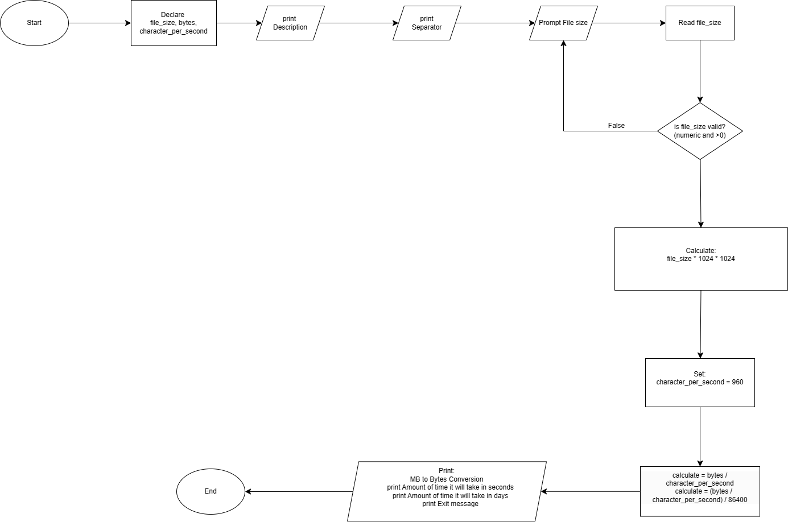

# Problem Analysis
## Input
1. File size in Megabytes (MB) (float)

## Output
1. Conversion of file size from MB to bytes
2. Time to transfer the file in seconds
3. Time to transfer the file in days
4. Exit message

## Operations
1. Input File Size in MB:
   - Prompt the user to enter the file size in MB.
   - Validate the input to ensure it is a positive number.
   - If the input is invalid (non-numeric or non-positive), clear the error state, ignore the invalid input, and prompt the user to enter the file size again.

2. Convert MB to Bytes:
   - Convert the file size from MB to bytes.
   - 1 MB = 1024 KB
   - 1 KB = 1024 Bytes
   - Therefore, bytes = file_size * 1024 * 1024

3. Calculate Transfer Time:
   - Given a transfer rate of 960 characters per second, calculate the time to transfer the file in seconds.
   - time_seconds = bytes / char_per_sec
   - Calculate the time to transfer the file in days.
   - time_days = time_seconds / 86400 (since 1 day = 86400 seconds)

4. Output Results:
   - Display the conversion of file size from MB to bytes.
   - Display the time to transfer the file in seconds.
   - Display the time to transfer the file in days.
   - Display the exit message.
# Pseudocode
start  
    Declare file_size,character_per_second,bytes  
    print Description  
    print Separator  
    
 file_size_entry:  
   print Enter file size in MB (Mega Bytes):  
   read file_size  
   if input invalid or file_size <= 0 then  
       
   print Invalid Input! Try Again.  
       goto file_size_entry 

   calculate file_size * 1024 * 1024  
    character_per_second = 960  
    calculate = bytes / character_per_second 
    calculate = (bytes / character_per_second) / 86400  

   print MB to Bytes Conversion  
   print Amount of time it will take in seconds  
   print Amount of time it will take in days  
   print Exit message  

end  
# Flowchart

