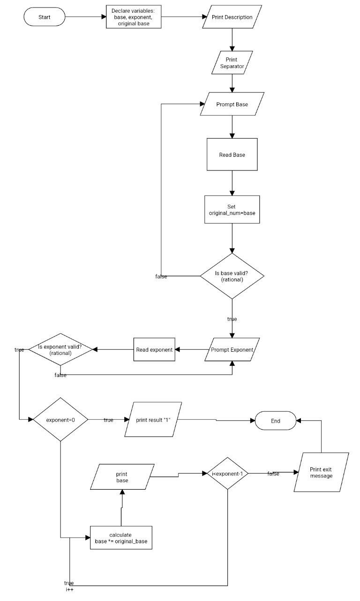

# Problem Analysis

## Input
1. Base of the exponential expression (float)
2. Exponent of the exponential expression (float)

## Output
1. Result of the exponential expression
2. Exit message

## Operations
1. **Input Description:**
   - Print a description of the program and instructions for the user.

2. **Input Base:**
   - Prompt the user to enter the base of the exponential expression.
   - Validate the input to ensure it is a numeric value.
   - If the input is invalid (non-numeric), clear the error state, ignore the invalid input, and prompt the user to enter the base again.

3. **Input Exponent:**
   - Prompt the user to enter the exponent of the exponential expression.
   - Validate the input to ensure it is a numeric value.
   - If the input is invalid (non-numeric), clear the error state, ignore the invalid input, and prompt the user to enter the exponent again.
   - If the exponent is 0, immediately output the result as 1 since any number to the power of 0 is 1.

4. **Calculate Exponential Result:**
   - Initialize a loop to calculate the power using the base and exponent.
   - Multiply the base by itself the number of times indicated by the exponent.

5. **Output Results:**
   - Display the result of the exponential expression.
   - Display the exit message.
# Pseudocode
start  
    declare float variables: base, exponent  
    print Description   
    print Separator   

    base_entry:  
    print "Enter the base: "  
    read base  
    if input is invalid:  
        clear input  
        print "Invalid Input! Try Again"  
        goto base_entry  
else  
    store original value of base in a new variable: original_base  

    exponent_entry:  
    print "Enter the exponent: "  
    read exponent  
    if input is invalid:  
        clear input  
        print "Invalid Input! Try Again"  
        goto exponent_entry  
else  if exponent is 0:  
        print "The result of original_base^0 is: 1"  
        print exit message  
        exit  
else  
    for i from 1 to exponent--:  
        base = base * original_base  

    print "The result of original_base^exponent is: base"  

    print exit message  
end  

# Flowchart

