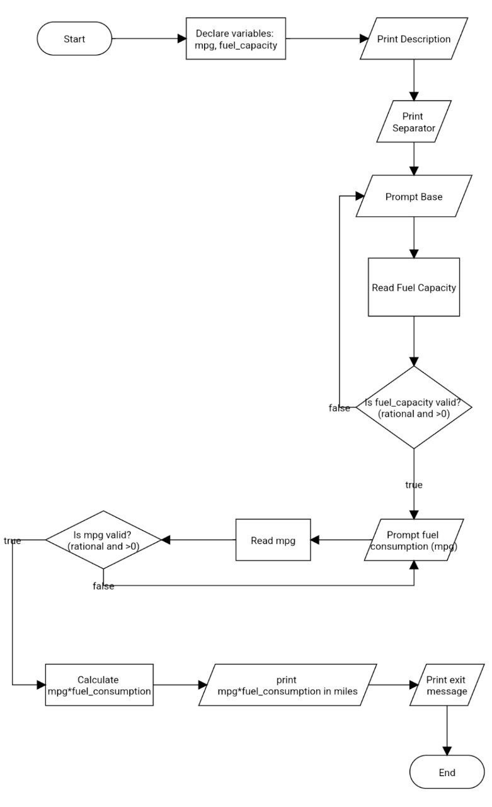

# Problem Analysis
## Input
- fuel_capacity (float): The fuel capacity of the car in gallons.
- mpg (float): The car's fuel consumption in miles per gallon (MPG).

## Output
- A message displaying the number of miles the car can go on a full tank of gas.

## Operation
1. **Declare Variables:**
   - Declare mpg and fuel_capacity as float variables.

2. **Display Description:**
   - Print a message that describes the purpose of the program and how it works.

3. **Print Separator:**
   - Print a separator line for better readability.

4. **Prompt for Fuel Capacity:**
   - **Capacity Entry Loop:**
     - Print a prompt asking the user to enter the car's fuel capacity in gallons.
     - Read and store the user's input in the variable fuel_capacity.
     - If the input is invalid (not a number or less than or equal to 0):
       - Print "Invalid input! Try Again".
       - Go back to capacity entry loop.

5. **Prompt for Fuel Consumption:**
   - **MPG Entry Loop:**
     - Print a prompt asking the user to enter the car's fuel consumption in miles per gallon (MPG).
     - Read and store the user's input in the variable mpg.
     - If the input is invalid (not a number or less than or equal to 0):
       - Print "Invalid input! Try Again".
       - Go back to MPG entry loop.

6. **Compute Miles:**
   - Calculate the number of miles the car can go by multiplying fuel_capacity by mpg.

7. **Display Result:**
   - Print the message showing how many miles the car can go on a full tank of gas.

8. **Print Exit Message:**
   - Print exit message.

# Pseudocode
start  
  declare float variables: mpg, fuel_capacity  

  print description  
  print separator  
  print Prompt for fuel tank capacity in gallons  
  read fuel_capacity  
  if fuel_capacity<=0 or cin.fail()  
    goto step 5  
else  

  print Prompt for car's fuel consumption in MPG  
  read mpg  
 if mpg<=0 or cin.fail()  
      goto step 8  
else    
  print mpg*fuel_capacity in miles  
  print Exit message  
end  
# Flowchart

