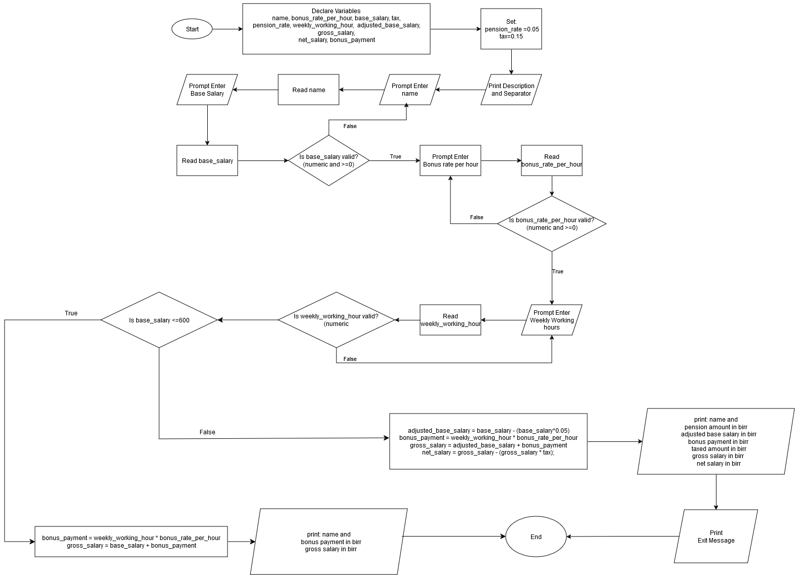

# Problem Analysis
## Input
1. Employee's name (string)
2. Base salary (float)
3. Bonus rate per hour (float)
4. Weekly working hours (int)

## Output
1. Employee's name
2. Amount paid for pension (calculated as 5% of base salary)
3. Adjusted base salary (base salary after pension deduction)
4. Bonus income (bonus rate per hour multiplied by weekly working hours)
5. Gross salary (adjusted base salary plus bonus income)
6. Amount cut for tax (calculated as 15% of gross salary)
7. Net salary (gross salary after tax deduction)
8. Exit message

## Operations
1. **Input Description:**
   - Print a description of the program and instructions for the user.

2. **Input Employee's Name:**
   - Prompt the user to enter the employee's name.
   - Check if the input is valid.
   - If invalid, clear the input and prompt again.

3. **Input Base Salary:**
   - Prompt the user to enter the base salary.
   - Check if the input is valid and greater than 0.
   - If invalid, clear the input and prompt again.

4. **Input Bonus Rate Per Hour:**
   - Prompt the user to enter the bonus rate per hour.
   - If there is no bonus rate, the user is instructed to enter "1".
   - Check if the input is valid and greater than 0.
   - If invalid, clear the input and prompt again.

5. **Input Weekly Working Hours:**
   - Prompt the user to enter the weekly working hours.
   - Check if the input is valid and greater than 0.
   - If invalid, clear the input and prompt again.

6. **Calculate Adjusted Base Salary:**
   - Subtract 5% (pension rate) from the base salary.

7. **Calculate Bonus Payment:**
   - Multiply the weekly working hours by the bonus rate per hour.

8. **Calculate Gross Salary:**
   - Add the adjusted base salary and the bonus payment.

9. **Calculate Tax Deduction:**
   - Multiply the gross salary by 15% (tax rate).

10. **Calculate Net Salary:**
    - Subtract the tax deduction from the gross salary.

11. **Output Results:**
    - Display the amount paid for pension.
    - Display the adjusted base salary.
    - Display the bonus income.
    - Display the amount cut for tax.
    - Display the gross salary.
    - Display the net salary.
    - Display exit message.
#Pseudocode
start  
    print Description  
    print Separator  

    name_entry:  
    print Prompt to enter name:  
    read name  
    if input invalid then  
        print Invalid Input! Try Again.  
        goto name_entry  
else  
    base_salary_entry:  
    print Prompt to enter base salary:  
    read base_salary  
    if input invalid or base_salary <= 0 then  
        print Invalid Input! Try Again.  
        goto base_salary_entry   
else  
    bonus_rate_per_hour_entry:  
    print Prompt to enter bonus rate per hour in birr. If there is no bonus rate, Enter 0:  
    read bonus_rate_per_hour   
    if input invalid or bonus_rate_per_hour <= 0 then  
        print Invalid Input! Try Again.  
        goto bonus_rate_per_hour_entry  
else  
    weekly_working_hour_entry:   
    print Prompt to enter weekly working hours:  
    read weekly_working_hour  
    if input invalid or weekly_working_hour <= 0 then  
        print Invalid Input! Try Again.  
        goto weekly_working_hour_entry  
else  
    adjusted_base_salary = base_salary - (base_salary * 0.05)  
    bonus_payment = weekly_working_hour * bonus_rate_per_hour  
    gross_salary = adjusted_base_salary + bonus_payment  
    tax_deduction = gross_salary * 0.15  
    net_salary = gross_salary - tax_deduction  

    print The amount you will pay for pension (5%) is:, base_salary, *, 0.05 =, base_salary * 0.05, Birr  
    print By this, the Adjusted Base Salary will be:, base_salary, -, base_salary * 0.05, =, adjusted_base_salary, Birr  
    print Your Bonus Income will be:, weekly_working_hour, *, bonus_rate_per_hour, =, bonus_payment, Birr  
    print The amount to be cut for tax is:, gross_salary, *, 0.15 =, tax_deduction, Birr  
    print The Gross Salary will be:, adjusted_base_salary, +, bonus_payment, =, gross_salary, Birr  
    print Finally, name, 's Net Salary will be:, gross_salary, -, tax_deduction, =, net_salary, Birr  
    print Exiting... Thank you  

end  
# Flowchart

